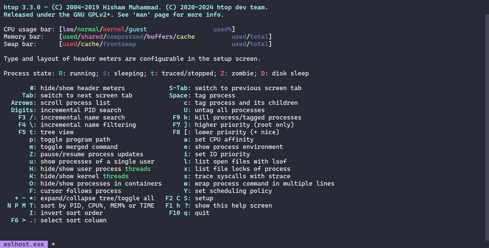
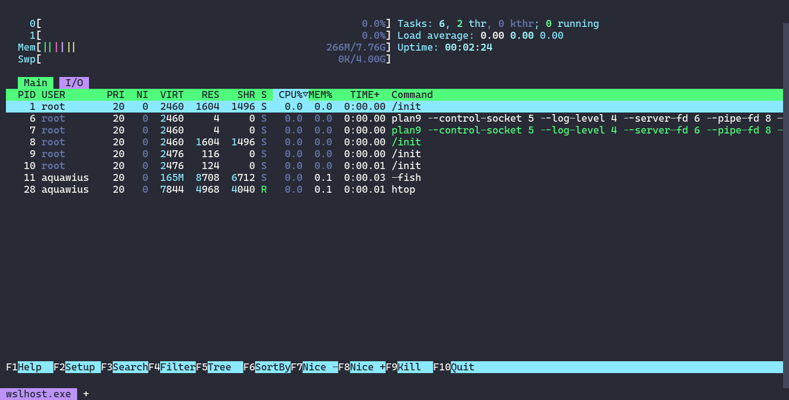
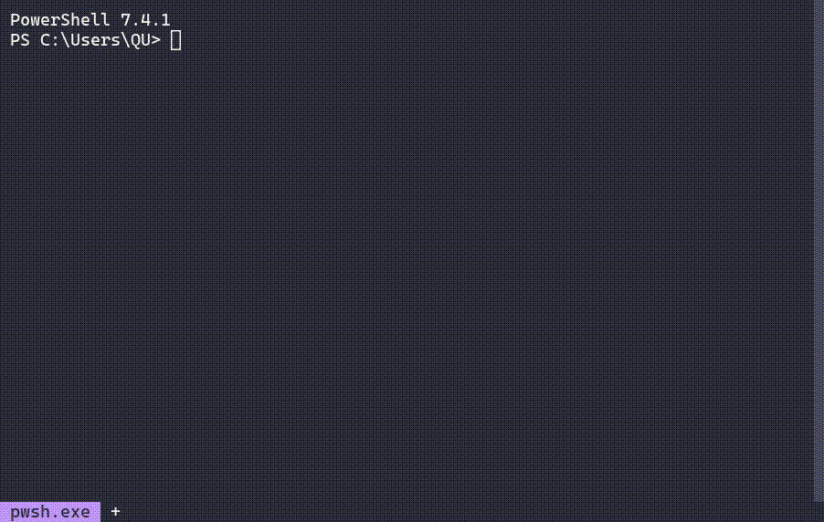
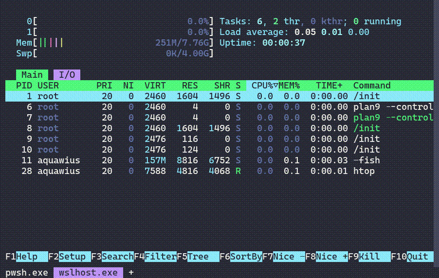

1. 下载并安装WezTerm

[WezTerm - Wez&apos;s Terminal Emulator](https://wezfurlong.org/wezterm/)

[下载 - Wez 的终端仿真器](https://wezfurlong.org/wezterm/installation.html)

2. 配置

    * windows：

      引入我的配置文件：

        1. `cd C:\Users\Xbss\.config`
        2. `git clone https://github.com/Xiaobaishushu25/WezTermTheme.git`
        3. 把`WezTermTheme`文件夹改名为`WezTerm`.
        4. 注意，我的配置文件中设置了背景图片，需要根据图片位置修改（我在仓库中也上传了我用的背景图片）：

            ```rust
                 background = {
                    {
                        source = {
                            File = "D:\\WezTerm\\img\\cb71e8f2232e4d93a16fd1aa9aae4c3f.jpg", -- 替换为你的图片路径
                        },
                        width = "100%",
                        height = "100%",
                        opacity = 0.95, -- 设置为 1.0 时不透明，0.0 时完全透明
                    },
                }
            ```

      如果你要手动创建配置文件：

        * 如果是单个文件，直接在`C:/Users/ `username` /.config/`下新建一个`.wezterm.lua`。
        * 如果是多个文件（比如还有配色配置），在`C:/Users/ `username` /.config/`新建一个`wezterm`文件夹，里面放`wezterm.lua`.

          ```rust
          C:\USERS
          ├─Public
          ├─QU（你的主目录）
          │  ├─Documents
          │  ├─Downloads
          │  ├─Pictures
          │  ├─.config
          │  │  ├─your others
          │  │  └─wezterm
          │  │     └─.git
          │  │     dracula.lua
          │  │     readme.md
          │  │     wezterm.lua
          │  │        ...
          ```


    参考两个：[wezterm-dracula-theme: 这是一个我自己的wezterm配置文件](https://gitee.com/aquawius/wezterm-dracula-theme)

      [wezterm-dracula-theme: 这是一个我自己的wezterm配置文件](https://gitee.com/aquawius/wezterm-dracula-theme)
3. 快捷键：

   鼠标滑动选中就默认直接复制了。

   `Ctrl+U`：快速删除当前所有待输入命令

   `Ctrl+N`:  新建一个Tab（我自己设置的命令）

## 这是一个我自己的[wezterm](https://wezfurlong.org/wezterm/)配置文件

> 又一个基于[dracula](https://draculatheme.com/)配色方案的[wezterm](https://wezfurlong.org/wezterm/)配置文件，增加了一些有用的功能。


### ✅ 特性

-  Dracula 配色方案。
-  美观的底部状态栏。
-  支持快速启动各种环境。（需要调整配置文件）

### :art: 一些截图





---

### 🔨 开始配置

1. ##### 切换至你的 `homedir/.config/` 文件夹。

    ```
    cd C:/Users/ `username` /.config/
    ```

    > （如果没有 `.config` 文件夹，请创建一个）

2. ##### 克隆仓库。

    ```shell
    git clone https://github.com/aquawius/wezterm-config.git
    ```

3. ##### 将 `wezterm-config` 重命名为 `wezterm`。

    ```shell
    C:\USERS
    ├─Public
    ├─QU（你的主目录）
    │  ├─Documents
    │  ├─Downloads
    │  ├─Pictures
    │  ├─.config
    │  │  ├─git
    │  │  └─wezterm	（将 wezterm-config 重命名为 wezterm）
    │  │     └─.git
    │  │     dracula.lua
    │  │     readme.md
    │  │     wezterm.lua
    │  │        ...
    ```

4. ##### 完成

欢迎提PR或Issue 😊

### :pushpin: 使用方法

您可以在终端底部找到一个 `+`。

> 单击 `+` 创建一个默认终端。（pwsh.exe）
>
> 右键单击 `+` 选择，您应该看到一个列出所有终端的列表
>
> 
>
> 中键单击选定的选项卡关闭此选项卡。
>
> 

------

### :speech_balloon: 你应该知道的东西

1. 配置的默认字体是 [CascadiaCode nerd font](https://www.programmingfonts.org/#cascadia-code)，您可以在此链接中下载：https://www.nerdfonts.com/font-downloads。

2. 默认 shell 是 `powershell7`（pwsh.exe），在 Linux 上是 `fish`。如果您没有这些 shell (或者你不想使用这些shell)，您可以在注释以下行：

    > 更改默认 shell：
    >
    > ```lua
    > default_prog = {'pwsh'},
    > ```

    > 更改 shell 列表：
    >
    > ```lua
    > shellCopy code   table.insert(config.launch_menu, {
    >         label = "Command Prompt",
    >         args = {"cmd.exe"}
    >     })
    >     table.insert(config.launch_menu, {
    >         label = "PowerShell 5",
    >         args = {"powershell.exe", "-NoLogo"}
    >     })
    >     table.insert(config.launch_menu, {
    >         label = "PowerShell 7",
    >         args = {"pwsh.exe", "-NoLogo"}
    >     })
    > 
    >     table.insert(config.launch_menu, {
    >         label = "Anaconda PowerShell Prompt",
    >         args = {"pwsh", "-NoLogo", "-NoExit", "-ExecutionPolicy", "Bypass", "-Command",
    >                 "& 'C:\\ProgramData\\anaconda3\\shell\\condabin\\conda-hook.ps1' ; conda activate 'C:\\ProgramData\\anaconda3' "}
    >     })
    > 
    >     table.insert(config.launch_menu, {
    >         label = "VS Command Prompt 2022 (PowerShell 7)",
    >         args = {"pwsh", "-NoLogo", "-NoExit", "-ExecutionPolicy", "Bypass", "-NoProfile", "-Command",
    >                 " & 'C:\\Program Files\\Microsoft Visual Studio\\2022\\Professional\\Common7\\Tools\\Launch-VsDevShell.ps1'"}
    >     })
    > 
    >     table.insert(config.launch_menu, {
    >         label = "Default WSL Command Prompt",
    >         args = {"wsl"}
    >     })
    > ```

3. 对于中文/英文用户，如果您希望正确获取 `launch_menu`（特别是 wsl 发行版），您应该取消以下行的注释：

```lua
            -- 对于英文用户，默认行：
            -- local distro = line:gsub(" %(Default%)", "")
            -- 对于中文用户，
            local distro = line:gsub(" %(默认%)", "")
```

**您可以在更改配置时更改所有内容。**（如果您有时间阅读 [Wezterm 文档](https://wezfurlong.org/wezterm)。）

> 此存储库没有许可证，您可以随意分发, 请尽情发挥你的创造力。

---

### 后记

> ###### 主题配色
>
> > 原本是我自己写的配置,用的自带的Sukura配色加上自己写的tab栏, 现在的配置文件改为使用[dracula官方提供的配色](https://github.com/dracula/wezterm.git)
> >
> > **原来的**
> >
>> 
> >
>> Dracula**官方提供的配色**
> >
> > 
> >
> > 怎么说,还是Dracula好看!  **Dracula yyds!**
> 
> ###### 关于配置文件
> 
> > 实话的说,我是从一个github的用户Ctrl-CV来的,名字已经忘记了,中间也被我改了一些东西,在此感谢那位不知名的github大佬,也要感谢wezterm带来了如此丰富的自定义终端!

